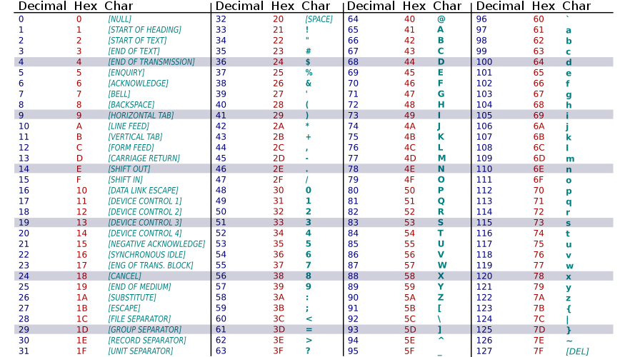

# Information Representation

The study of information representation is one of the parts that constitutes Computer Science. The relevance of information representation is based on the necesity of two entities, sender and recipient, to communicate by sending a message through a medium.

In order for the send and recipient to communicate the message have to be codified in a format that both can understand. For example, the number four can be represented with the arabic numeral 4 or with the roman numeral IV. If the sender codifies the number four in arabic numerals, but the recipient is expecting the information contained in the message to be in roman numeral the communication will fail.

## Numeral Systems

The different numeral systems we are covering in this section, besides binary, are only important from the human perspective. That is because computers only understand binary, but lots of times we have to reference some data encoded in binary and that is when the other numeral systems such as octal and hexadecimal are useful.

### Decimal (Base 10)

Decimal is the most commonly used numeral system. It is the one you have been using at school and your daily life. The symbols used in the decimal system start from 0 and go until 9.

### Binary (Base 2)

Binary is the numeral system used by computers. The symbols used in the binary system are 0 and 1. You can think about it as a light switch, it only has two possible positions. Each one of the characters of the binary representation is called a *bit*.

| Base 10 | Base 2 |
|:-:|:-:|
| 0 | 0 |
| 1 | 1 |
| 2 | 10 |
| 3 | 11 |
| 4 | 100 |
| 5 | 101 |
| 6 | 110 |
| 7 | 111 |

#### Convertion from Binary to Decimal

The easiest way to convert a number from binary to its decimal representation is by writing down the power of 2 based on its position moving from right to left. For example, the number `101010` would have the following representation in powers of 2.

| Powers of 2 | 2^5 | 2^4 | 2^3 | 2^2 | 2^1 | 2^0 |
|:-:|:-:|:-:|:-:|:-:|:-:|:-:|
| Powers of 2 | 32 | 16 | 8 | 4 | 2 | 1 |
| Binary number | 1 | 0 | 1 | 0 | 1 | 0 |
| Binary number matches | 32 | 0 | 8 | 0 | 2 | 0 |

The last step left is to sum up all the powers of 2 that matches with a position that has a 1 in the binary form. Therefore, the number `101010` in binary has the decimal representation of `42`.

#### Convertion from Decimal to Binary

In order to go from the decimal representation to the binary one, the only operation needed it's to divide the number by 2 over and over until the number is 1. Then you need to look at the list of remainders from the division starting from the last division to the first. For example, take number `42` in decimal and perform the divisions.

| Division | Remainder |
|:-:|:-:|
| 42 / 2 = 21 | 0 |
| 21 / 2 = 10 | 1 |
| 10 / 2 = 5 | 0 |
| 5 / 2 = 2 | 1 |
| 2 / 2 = 1 | 0 |
| 1 | 1 |

Now, starting from the last remainder and going back up the chain you obtain the representation of `101010`.

### Octal (Base 8)

Octal is an important representation because *a group of 8 bits is a byte*, it also helps that it is easier to remember `252` than `10101010`. Octal has 8 different symbols to represent its possible digits, the are from 0 to 7, like in decimal.

| Base 10 | Base 2 | Base 8 |
|:-:|:-:|:-:|
| 0 | 0 | 0 |
| 1 | 1 | 1 |
| 2 | 10 | 2 |
| 3 | 11 | 3 |
| 4 | 100 | 4 |
| 5 | 101 | 5 |
| 6 | 110 | 6 |
| 7 | 111 | 7 |
| 8 | 1000 | 10 |
| 9 | 1001 | 11 |
| 10 | 1010 | 12 |
| 11 | 1011 | 13 |
| 12 | 1100 | 14 |
| 13 | 1101 | 15 |
| 14 | 1110 | 16 |
| 15 | 1111 | 17 |
| 16 | 10000 | 20 |

### Hexadecimal (Base 16)

Since most of the computers today have 64 bits processors it would be hard for humans to remember addresses containing numbers that have a length of 64 digits in binary or 22 digits in octal, but it would be easier with 16 digits in hexadecimal.

Hexadecimal has 16 different symbols to represent its possible digits, they are from 0 to 9, like in decimal, and the from A to F, like in the alphabet.

| Base 10 | Base 2 | Base 8 | Base 16 |
|:-:|:-:|:-:|:-:|:-:|
| 0 | 0 | 0 | 0 |
| 1 | 1 | 1 | 1 |
| 2 | 10 | 2 | 2 |
| 3 | 11 | 3 | 3 |
| 4 | 100 | 4 | 4 |
| 5 | 101 | 5 | 5 |
| 6 | 110 | 6 | 6 |
| 7 | 111 | 7 | 7 |
| 8 | 1000 | 10 | 8 |
| 9 | 1001 | 11 | 9 |
| 10 | 1010 | 12 | A |
| 11 | 1011 | 13 | B |
| 12 | 1100 | 14 | C |
| 13 | 1101 | 15 | D |
| 14 | 1110 | 16 | E |
| 15 | 1111 | 17 | F |
| 16 | 10000 | 20 | 10 |

## ASCII

As it was explained before, computers only understand binary information, but for them to be useful for humans they need to understand other ways to represent information, such as letters, puntuation symbols, etc. The first approach to accomplish this feat was using the ASCII table.

The ASCII table is a set of symbols that have a unique value of 7 bits assigned to it. That way you can use a bit less than a byte, pun intended, to represent all the english alphabet and other required symbols.

Since the ASCII table is limited to only characters of the english alphabet, it does not contain vowels with tildes, and special characters. That was introduced in the *Extended ASCII table*. It uses 8 bits to represent the symbols, that means it actually doubles the amount of symbols contained in the table.

## Unicode

## SI Prefixes

| Prefix Name | Prefix Symbol | Base 10 |
|:-:|:-:|:-:|
| kilo | K | 10^3 |
| mega | M | 10^6 |
| giga | G | 10^9 |
| tera | T | 10^12 |
| peta | P | 10^15 |
| exa | E | 10^18 |

## Exercises

# Logic

## Logic Operations

### AND (&)

| A | B | A & B |
|:-:|:-:|:-:|
| 0 | 0 | 0 |
| 0 | 1 | 0 |
| 1 | 0 | 0 |
| 1 | 1 | 1 |

### OR (|)

| A | B | A \| B |
|:-:|:-:|:-:|
| 0 | 0 | 0 |
| 0 | 1 | 1 |
| 1 | 0 | 1 |
| 1 | 1 | 1 |

### NOT (~)

| A | ~A |
|:-:|:-:|
| 0 | 1 |
| 1 | 0 |

### XOR (^)

| A | B | A ^ B |
|:-:|:-:|:-:|
| 0 | 0 | 0 |
| 0 | 1 | 1 |
| 1 | 0 | 1 |
| 1 | 1 | 0 |

### NAND

| A | B | ~(A & B) |
|:-:|:-:|:-:|
| 0 | 0 | 1 |
| 0 | 1 | 1 |
| 1 | 0 | 1 |
| 1 | 1 | 0 |

### NOR

| A | B | ~(A \| B) |
|:-:|:-:|:-:|
| 0 | 0 | 1 |
| 0 | 1 | 0 |
| 1 | 0 | 0 |
| 1 | 1 | 0 |

## De Morgan's Laws

### Negation of disjunction

| A | B | ~(A \| B) | ~A | ~B | ~A & ~B |
|:-:|:-:|:-:|:-:|:-:|:-:|
| 0 | 0 | 1 | 1 | 1 | 1 |
| 0 | 1 | 0 | 1 | 0 | 0 |
| 1 | 0 | 0 | 0 | 1 | 0 |
| 1 | 1 | 0 | 0 | 0 | 0 |

### Negation of conjunction

| A | B | ~(A & B) | ~A | ~B | ~A \| ~B |
|:-:|:-:|:-:|:-:|:-:|:-:|
| 0 | 0 | 1 | 1 | 1 | 1 |
| 0 | 1 | 1 | 1 | 0 | 1 |
| 1 | 0 | 1 | 0 | 1 | 1 |
| 1 | 1 | 0 | 0 | 0 | 0 |

# Computer parts

## Processor

The processor is the brain of the computer. It can have multiple cores and handle even more threads. The speed of a processor is measured in Hertz (Hz).

### Cores

### Threads

## Motherboard

## RAM

## Storage

### Hard Disk Drive (HDD)

#### IDE

#### SATA

### Solid State Drive (SSD)

#### SATA

#### PCI

## Graphics Card

### Integrated

### Dedicated

## I/O Devices

### Screen Monitor

### Keyboard

### Mouse

### Periferals

# Operating Systems

## Windows

## Mac OS

## GNU/Linux

# Build a computer from scratch 

## BIOS/UEFI

## HDDs and Partitions

## Installation of the OS

## Set up of the OS

## Installation of Apps

# System on a Chip (SoC)

## Raspberry Pi

## Smartphone

## Smart TV

## IoT

# Internet

## MAC Address

## IP Address

## DNS

## HTTP(S)

## (S)FTP

## Cloud

### Amazon Web Services (AWS)

### Google Cloud Computing (GCC)

### Microsoft Azure

# Information Security

## VPN

## Dangers of Open Networks

## Backup strategies
