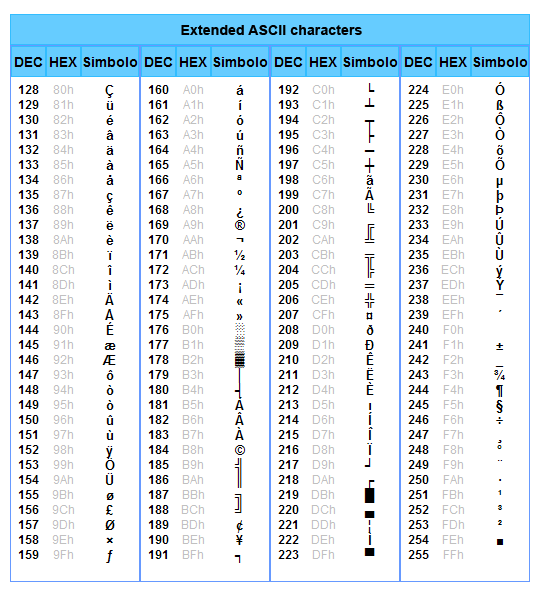
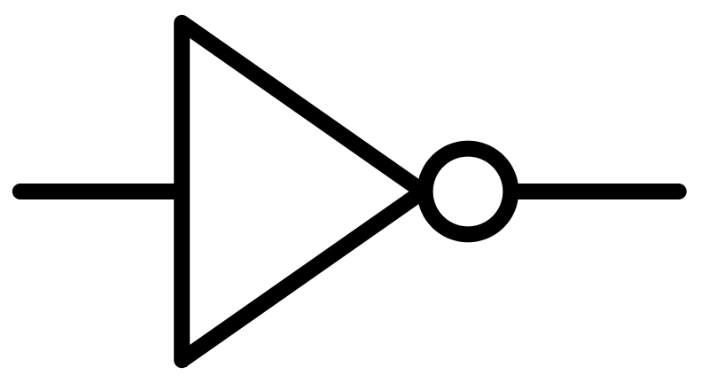

# Information Representation

The study of information representation is one of the parts that constitutes Computer Science. The relevance of information representation is based on the necesity of two entities, sender and recipient, to communicate by sending a message through a medium.

In order for the send and recipient to communicate the message have to be codified in a format that both can understand. For example, the number four can be represented with the arabic numeral 4 or with the roman numeral IV. If the sender codifies the number four in arabic numerals, but the recipient is expecting the information contained in the message to be in roman numeral the communication will fail.

## Numeral Systems

The different numeral systems we are covering in this section, besides binary, are only important from the human perspective. That is because computers only understand binary, but lots of times we have to reference some data encoded in binary and that is when the other numeral systems such as octal and hexadecimal are useful.

### Decimal (Base 10)

Decimal is the most commonly used numeral system. It is the one you have been using at school and your daily life. The symbols used in the decimal system start from 0 and go until 9.

### Binary (Base 2)

Binary is the numeral system used by computers. The symbols used in the binary system are 0 and 1. You can think about it as a light switch, it only has two possible positions. Each one of the characters of the binary representation is called a *bit*.

| Base 10 | Base 2 |
|:-:|:-:|
| 0 | 0 |
| 1 | 1 |
| 2 | 10 |
| 3 | 11 |
| 4 | 100 |
| 5 | 101 |
| 6 | 110 |
| 7 | 111 |

#### Convertion from Binary to Decimal

The easiest way to convert a number from binary to its decimal representation is by writing down the power of 2 based on its position moving from right to left. For example, the number `101010` would have the following representation in powers of 2.

| Powers of 2 | 2^5 | 2^4 | 2^3 | 2^2 | 2^1 | 2^0 |
|:-:|:-:|:-:|:-:|:-:|:-:|:-:|
| Powers of 2 | 32 | 16 | 8 | 4 | 2 | 1 |
| Binary number | 1 | 0 | 1 | 0 | 1 | 0 |
| Binary number matches | 32 | 0 | 8 | 0 | 2 | 0 |

The last step left is to sum up all the powers of 2 that matches with a position that has a 1 in the binary form. Therefore, the number `101010` in binary has the decimal representation of `42`.

#### Convertion from Decimal to Binary

In order to go from the decimal representation to the binary one, the only operation needed it's to divide the number by 2 over and over until the number is 1. Then you need to look at the list of remainders from the division starting from the last division to the first. For example, take number `42` in decimal and perform the divisions.

| Division | Remainder |
|:-:|:-:|
| 42 / 2 = 21 | 0 |
| 21 / 2 = 10 | 1 |
| 10 / 2 = 5 | 0 |
| 5 / 2 = 2 | 1 |
| 2 / 2 = 1 | 0 |
| 1 | 1 |

Now, starting from the last remainder and going back up the chain you obtain the representation of `101010`.

### Octal (Base 8)

Octal is an important representation because *a group of 8 bits is a byte*, it also helps that it is easier to remember `252` than `10101010`. Octal has 8 different symbols to represent its possible digits, the are from 0 to 7, like in decimal.

| Base 10 | Base 2 | Base 8 |
|:-:|:-:|:-:|
| 0 | 0 | 0 |
| 1 | 1 | 1 |
| 2 | 10 | 2 |
| 3 | 11 | 3 |
| 4 | 100 | 4 |
| 5 | 101 | 5 |
| 6 | 110 | 6 |
| 7 | 111 | 7 |
| 8 | 1000 | 10 |
| 9 | 1001 | 11 |
| 10 | 1010 | 12 |
| 11 | 1011 | 13 |
| 12 | 1100 | 14 |
| 13 | 1101 | 15 |
| 14 | 1110 | 16 |
| 15 | 1111 | 17 |
| 16 | 10000 | 20 |

### Hexadecimal (Base 16)

Since most of the computers today have 64 bits processors it would be hard for humans to remember addresses containing numbers that have a length of 64 digits in binary or 22 digits in octal, but it would be easier with 16 digits in hexadecimal.

Hexadecimal has 16 different symbols to represent its possible digits, they are from 0 to 9, like in decimal, and the from A to F, like in the alphabet.

| Base 10 | Base 2 | Base 8 | Base 16 |
|:-:|:-:|:-:|:-:|:-:|
| 0 | 0 | 0 | 0 |
| 1 | 1 | 1 | 1 |
| 2 | 10 | 2 | 2 |
| 3 | 11 | 3 | 3 |
| 4 | 100 | 4 | 4 |
| 5 | 101 | 5 | 5 |
| 6 | 110 | 6 | 6 |
| 7 | 111 | 7 | 7 |
| 8 | 1000 | 10 | 8 |
| 9 | 1001 | 11 | 9 |
| 10 | 1010 | 12 | A |
| 11 | 1011 | 13 | B |
| 12 | 1100 | 14 | C |
| 13 | 1101 | 15 | D |
| 14 | 1110 | 16 | E |
| 15 | 1111 | 17 | F |
| 16 | 10000 | 20 | 10 |

## ASCII

As it was explained before, computers only understand binary information, but for them to be useful for humans they need to understand other ways to represent information, such as letters, puntuation symbols, etc. The first approach to accomplish this feat was using the **American Standard Code for Information Interchange (ASCII) table**.

The ASCII table is a set of symbols that have a unique value of 7 bits assigned to it. That way you can use a bit less than a byte, pun intended, to represent all the english alphabet and other required symbols.

### Extended ASCII

Since the ASCII table is limited to only characters of the english alphabet, it does not contain vowels with tildes, and other special characters. They were was introduced in the **Extended ASCII table**. It uses 8 bits to represent the symbols, that means it actually doubles the amount of symbols contained in the table.

## Unicode

You now might be tempted to think that we have covered all required characters to write in any language, if you do you would be mistaken. There are lots of languages that uses a different alphabet such as Arabic, Chinese, Hebrew, Japanese, Korean, Russian, and others. Moreover, we also use emojis and they need to be codified in order for the computers to understand it.

The standard that covers all previous alphabets and have room left for future extensions is the Unicode. There are several formats in the Unicode standard, the most common ones are **UTF-8**, **UTF-16**. They use 8 and 16 bits respectively to codify the characters.

## SI Prefixes

Although we have been talking about bites and bytes, when storing big amounts of data they becomes unsustainable to describe the size of the information in them. That is when the Metric's System prefixes become useful.

| Prefix Name | Prefix Symbol | Base 10 |
|:-:|:-:|:-:|
| kilo | K | 10^3 |
| mega | M | 10^6 |
| giga | G | 10^9 |
| tera | T | 10^12 |
| peta | P | 10^15 |
| exa | E | 10^18 |

For example, 3000 bytes (or 3000B) can be expressed as 3KB or 5600000B can be also expressed as 5.6MB.

## Exercises

# Boolean algebra

Boolean algebra is the branch of algebra in which the values of the variables are the truth values true and false, usually denoted 1 and 0, respectively. 

The main operations of Boolean algebra are the conjunction (and) denoted as `&`, the disjunction (or) denoted as `|`, and the complement (not) denoted as `~`. These operations are also implemented as circuit components known as gates.

## Conjunction (AND)

The logical conjunction (and) it is true if and only if all of its operands are true. The logic gate, circuit, that implements the conjunction is { width=5% }.

| A | B | A & B |
|:-:|:-:|:-:|
| 0 | 0 | 0 |
| 0 | 1 | 0 |
| 1 | 0 | 0 |
| 1 | 1 | 1 |

## Disjunction (OR)

The logical disjunction (or) it is true if any of its operands are true. The logic gate, circuit, that implements the disjunction is { width=5% }.

| A | B | A \| B |
|:-:|:-:|:-:|
| 0 | 0 | 0 |
| 0 | 1 | 1 |
| 1 | 0 | 1 |
| 1 | 1 | 1 |

## Complement (NOT)

The logical complement, also called negation, it is true when its operand is false, or it is false when its operand is true. The logic gate, circuit, that implements the negation is { width=5% }.

| A | ~A |
|:-:|:-:|
| 0 | 1 |
| 1 | 0 |

## XOR (^)

The xor, the name comes from eXclusive OR, it is the first operation that it is not part of the main logic operations. It is true when one and only one of its operands it is true. The logic gate, circuit, that implements the exclusive or is { width=5% }.

| A | B | A ^ B |
|:-:|:-:|:-:|
| 0 | 0 | 0 |
| 0 | 1 | 1 |
| 1 | 0 | 1 |
| 1 | 1 | 0 |

## NAND

The nand, the name comes from Not AND, it is the negation of the conjunction. That means that it is true when not all of its operands are true. The logic gate, circuit, that implements the nand is { width=5% }.

| A | B | ~(A & B) |
|:-:|:-:|:-:|
| 0 | 0 | 1 |
| 0 | 1 | 1 |
| 1 | 0 | 1 |
| 1 | 1 | 0 |

## NOR

The nor, the name comes from Not OR, it is the negation of the disjunction. That menas that it is true when none of its operands are true. The logic gate, circuit, that implements the nor is { width=5% }.

| A | B | ~(A \| B) |
|:-:|:-:|:-:|
| 0 | 0 | 1 |
| 0 | 1 | 0 |
| 1 | 0 | 0 |
| 1 | 1 | 0 |

## De Morgan's Laws

In Boolean algebra De Morgan's Laws are a pair of transformation rules that are both valid rules of inference. The rules allow the expression of conjunctions and disjunctions purely in terms of each other via negations.

The rules can be expressed in English as:

* The negation of the disjunction is the conjunction of the negations. 
* The negation of the conjunction is the disjunction of the negations.

### Negation of the disjunction

| A | B | ~(A \| B) | ~A | ~B | ~A & ~B |
|:-:|:-:|:-:|:-:|:-:|:-:|
| 0 | 0 | 1 | 1 | 1 | 1 |
| 0 | 1 | 0 | 1 | 0 | 0 |
| 1 | 0 | 0 | 0 | 1 | 0 |
| 1 | 1 | 0 | 0 | 0 | 0 |

### Negation of the conjunction

| A | B | ~(A & B) | ~A | ~B | ~A \| ~B |
|:-:|:-:|:-:|:-:|:-:|:-:|
| 0 | 0 | 1 | 1 | 1 | 1 |
| 0 | 1 | 1 | 1 | 0 | 1 |
| 1 | 0 | 1 | 0 | 1 | 1 |
| 1 | 1 | 0 | 0 | 0 | 0 |

# Computer components

The computer is made of several components and each one of them has a very specific role. There are some components that are mandatory for the computer in order for it to run. These are, processor, motherboard, RAM, and power supply.

## Processor

The processor is the brain of the computer. It can have multiple cores and handle even more threads. The speed of a processor is measured in Hertz (Hz).

### Cores

### Threads

## Motherboard

## RAM

## Storage

### Hard Disk Drive (HDD)

#### IDE

#### SATA

### Solid State Drive (SSD)

#### SATA

#### PCI

## Graphics Card

### Integrated

### Dedicated

## Power Supply

## I/O Devices

### Screen Monitor

### Keyboard

### Mouse

### Periferals

# Operating Systems

## Windows

## Mac OS

## GNU/Linux

# Build a computer from scratch 

## BIOS/UEFI

## HDDs and Partitions

## Installation of the OS

## Set up of the OS

## Installation of Apps

# System on a Chip (SoC)

## Raspberry Pi

## Smartphone

## Smart TV

## IoT

# Internet

## MAC Address

## IP Address

## DNS

## HTTP(S)

## (S)FTP

## Cloud

### Amazon Web Services (AWS)

### Google Cloud Computing (GCC)

### Microsoft Azure

# Information Security

## VPN

## Dangers of Open Networks

## Backup strategies
